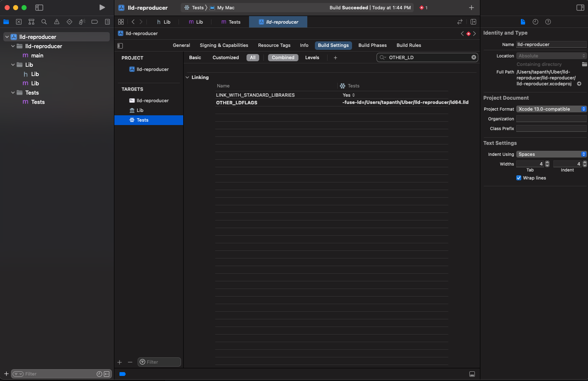
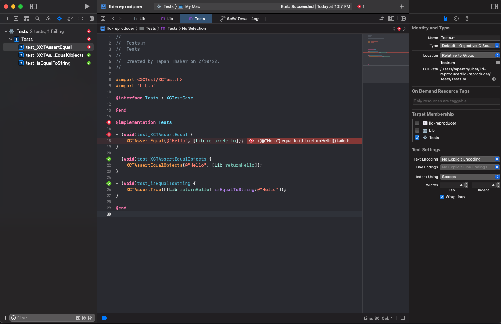

# lld-reproducer
A sample project to reproduce a bug where XCTAssertEqual fails if we use LLVM's LLD instead of LD64

Steps to reproduce:

- Downlod LLD from https://github.com/keith/ld64.lld/releases/tag/c5fef77bc35d
- In set `OTHER_LD_FLAGS` for `Tests` target to: `-fuse-ld=<absolute path to lld>`

- Build and run tests

Expected: `test_XCTAssertEqual` should pass but it fails

